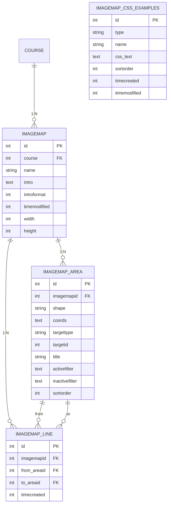
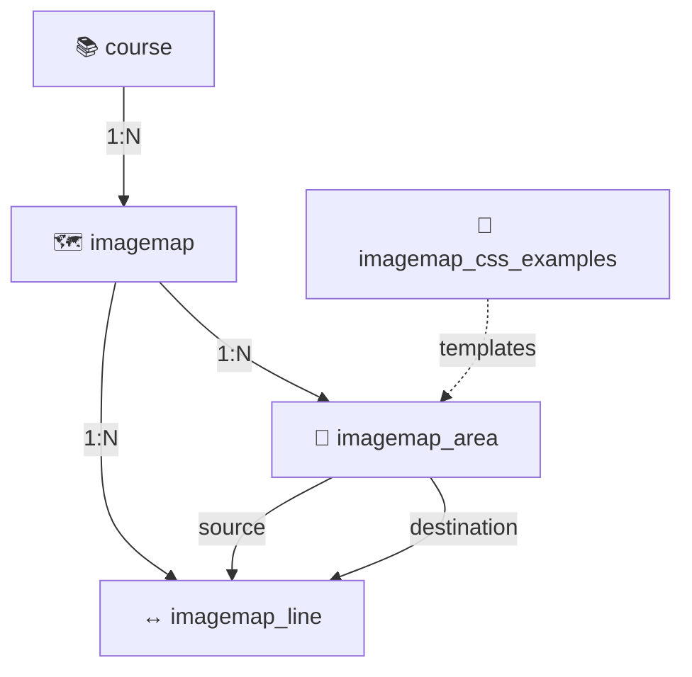
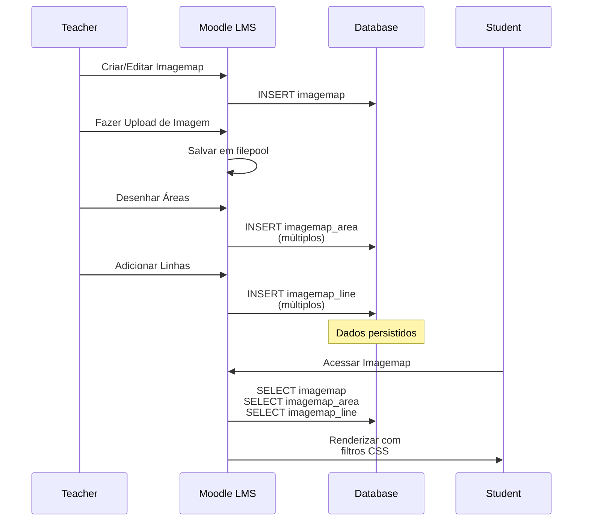

# 🗄️ Esquema de Banco de Dados - mod_imagemap

Documentação completa da estrutura de banco de dados do módulo mod_imagemap, incluindo tabelas, campos e relacionamentos.

---

## 📊 Diagrama ER (Entity-Relationship)



---

## 📋 Tabelas Detalhadas

### 1. Tabela: `imagemap`

**Descrição**: Tabela principal armazenando instâncias de atividades imagemap.

| Campo | Tipo | Nulo | Padrão | Descrição |
|-------|------|------|--------|-----------|
| `id` | INT(10) | ✗ | - | Chave primária, auto-incremento |
| `course` | INT(10) | ✗ | 0 | FK para `course.id` - ID do curso |
| `name` | CHAR(255) | ✗ | - | Nome da atividade imagemap |
| `intro` | TEXT | ✓ | NULL | Descrição/introdução da atividade |
| `introformat` | INT(4) | ✗ | 0 | Formato do intro (0=HTML, 1=Markdown, etc) |
| `timemodified` | INT(10) | ✗ | 0 | Timestamp da última modificação |
| `width` | INT(10) | ✓ | NULL | Largura da imagem em pixels |
| `height` | INT(10) | ✓ | NULL | Altura da imagem em pixels |

**Índices**:
- `PRIMARY KEY (id)`
- `FOREIGN KEY (course) REFERENCES course(id)`

---

### 2. Tabela: `imagemap_area`

**Descrição**: Áreas clicáveis definidas dentro do imagemap.

| Campo | Tipo | Nulo | Padrão | Descrição |
|-------|------|------|--------|-----------|
| `id` | INT(10) | ✗ | - | Chave primária, auto-incremento |
| `imagemapid` | INT(10) | ✗ | 0 | FK para `imagemap.id` |
| `shape` | CHAR(20) | ✗ | - | Tipo de forma: 'circle', 'rect', 'poly' |
| `coords` | TEXT | ✗ | - | Coordenadas da forma (JSON ou string) |
| `targettype` | CHAR(20) | ✗ | 'module' | Tipo de alvo: 'module' ou 'section' |
| `targetid` | INT(10) | ✗ | 0 | ID do módulo ou seção de destino |
| `title` | CHAR(255) | ✓ | NULL | Título/rótulo da área |
| `activefilter` | TEXT | ✓ | NULL | CSS filter quando ativo |
| `inactivefilter` | TEXT | ✓ | NULL | CSS filter quando inativo |
| `sortorder` | INT(10) | ✗ | 0 | Ordem de exibição das áreas |

**Índices**:
- `PRIMARY KEY (id)`
- `FOREIGN KEY (imagemapid) REFERENCES imagemap(id)`

---

### 3. Tabela: `imagemap_line`

**Descrição**: Linhas de conexão entre áreas dentro de um imagemap.

| Campo | Tipo | Nulo | Padrão | Descrição |
|-------|------|------|--------|-----------|
| `id` | INT(10) | ✗ | - | Chave primária, auto-incremento |
| `imagemapid` | INT(10) | ✗ | 0 | FK para `imagemap.id` |
| `from_areaid` | INT(10) | ✗ | - | FK para `imagemap_area.id` (origem) |
| `to_areaid` | INT(10) | ✗ | - | FK para `imagemap_area.id` (destino) |
| `timecreated` | INT(10) | ✗ | 0 | Timestamp de criação |

**Índices**:
- `PRIMARY KEY (id)`
- `FOREIGN KEY (imagemapid) REFERENCES imagemap(id)`
- `FOREIGN KEY (from_areaid) REFERENCES imagemap_area(id)`
- `FOREIGN KEY (to_areaid) REFERENCES imagemap_area(id)`
- `UNIQUE INDEX (imagemapid, from_areaid, to_areaid)` - Evita linhas duplicadas

---

### 4. Tabela: `imagemap_css_examples`

**Descrição**: Exemplos de CSS pré-configurados para filtros ativos/inativos.

| Campo | Tipo | Nulo | Padrão | Descrição |
|-------|------|------|--------|-----------|
| `id` | INT(10) | ✗ | - | Chave primária, auto-incremento |
| `type` | CHAR(10) | ✗ | - | Tipo de filtro: 'active' ou 'inactive' |
| `name` | CHAR(255) | ✗ | - | Nome do exemplo CSS |
| `css_text` | TEXT | ✗ | - | Código CSS do filtro |
| `sortorder` | INT(10) | ✗ | 0 | Ordem de exibição |
| `timecreated` | INT(10) | ✗ | 0 | Timestamp de criação |
| `timemodified` | INT(10) | ✗ | 0 | Timestamp da última modificação |

**Índices**:
- `PRIMARY KEY (id)`
- `INDEX (type)` - Para buscar filtros por tipo
- `INDEX (sortorder)` - Para ordenação eficiente

---

## 🔗 Relacionamentos



### Descrição dos Relacionamentos:

1. **course → imagemap** (1:N)
   - Cada curso pode ter múltiplas atividades imagemap
   - Uma imagemap pertence a exatamente um curso
   - Cascata: Deletar curso deleta todos os imagemaps

2. **imagemap → imagemap_area** (1:N)
   - Cada imagemap pode ter múltiplas áreas clicáveis
   - Cada área pertence a exatamente um imagemap
   - Cascata: Deletar imagemap deleta todas as áreas

3. **imagemap → imagemap_line** (1:N)
   - Cada imagemap pode ter múltiplas linhas de conexão
   - Cada linha pertence a exatamente um imagemap

4. **imagemap_area → imagemap_line** (1:N - ambas as direções)
   - `from_areaid`: área de origem da linha
   - `to_areaid`: área de destino da linha
   - Uma área pode ser origem/destino de múltiplas linhas

5. **imagemap_css_examples** (Standalone)
   - Tabela de referência com exemplos CSS
   - Sem relacionamento direto com outras tabelas
   - Usada para fornecer templates ao usuário

---

## 📐 Estrutura de Dados JSON

### Exemplos de Formatos

#### Coordenadas de Circulo (shape = 'circle')
```json
{
  "cx": 150,
  "cy": 100,
  "r": 50
}
```

#### Coordenadas de Retângulo (shape = 'rect')
```json
{
  "x1": 50,
  "y1": 50,
  "x2": 200,
  "y2": 150
}
```

#### Coordenadas de Polígono (shape = 'poly')
```json
{
  "points": [
    [10, 20],
    [50, 10],
    [100, 30],
    [80, 80]
  ]
}
```

---

## 🔄 Ciclo de Vida dos Dados



---

## 📊 Estatísticas e Performance

### Queries Mais Comuns

#### 1. Recuperar um Imagemap completo
```sql
-- Recuperar imagemap + todas as áreas + linhas
SELECT i.*, a.*, l.*
FROM {imagemap} i
LEFT JOIN {imagemap_area} a ON a.imagemapid = i.id
LEFT JOIN {imagemap_line} l ON l.imagemapid = i.id
WHERE i.id = ?
ORDER BY a.sortorder, l.timecreated;
```

#### 2. Deletar Imagemap (cascata)
```sql
-- Deleta imagemap_line primeiro (FK)
DELETE FROM {imagemap_line} 
WHERE imagemapid = ?;

-- Depois imagemap_area (FK)
DELETE FROM {imagemap_area} 
WHERE imagemapid = ?;

-- Por fim imagemap
DELETE FROM {imagemap} 
WHERE id = ?;
```

#### 3. Recuperar linhas de uma área
```sql
SELECT l.*, a1.title as from_title, a2.title as to_title
FROM {imagemap_line} l
JOIN {imagemap_area} a1 ON l.from_areaid = a1.id
JOIN {imagemap_area} a2 ON l.to_areaid = a2.id
WHERE l.imagemapid = ? AND (l.from_areaid = ? OR l.to_areaid = ?);
```

### Dicas de Performance

- **Índices**: Verificar índices em `imagemapid` para operações de JOIN
- **Agregações**: Usar `COUNT()` com GROUP BY para análises
- **Paginação**: Implementar LIMIT/OFFSET para listas longas
- **Cache**: Usar cache de Moodle para dados frequentemente acessados

---

## 🔐 Segurança e Integridade

### Chaves Estrangeiras
- ✅ Validar `course` existe em `course`
- ✅ Validar `imagemapid` existe em `imagemap`
- ✅ Validar `from_areaid` e `to_areaid` existem em `imagemap_area`
- ✅ Cascata: Deletar imagemap deleta áreas e linhas

### Validação de Dados
- **Shape**: Apenas 'circle', 'rect', 'poly' são aceitos
- **TargetType**: Apenas 'module' ou 'section' são aceitos
- **Coordenadas**: Devem ser JSON válido
- **SortOrder**: Deve ser >= 0

### Constraints
- Evitar duplicação de linhas com índice UNIQUE
- Evitar IDs inválidos com FK constraints
- Espaço de disco: Monitorar tamanho da coluna `coords` em areas

---

## 📝 Versionamento do Schema

Versão atual: **20260211** (em `db/install.xml`)

Histórico de mudanças em `db/upgrade.php`:
- Versões anteriores documentadas em CHANGELOG.md
- Scripts de upgrade automáticos aplicados no upgrade do Moodle

---

## 🔗 Referências

- [Moodle Database API](https://docs.moodle.org/dev/Database_API)
- [Moodle XMLDB Format](https://docs.moodle.org/dev/XMLDB)
- [File API](https://docs.moodle.org/dev/File_API)
- [Database Optimization](https://docs.moodle.org/dev/Database_optimization)

